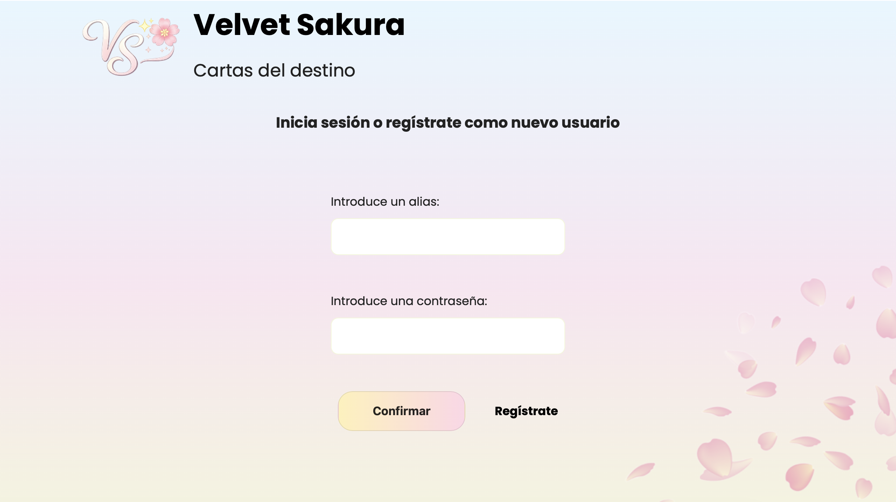
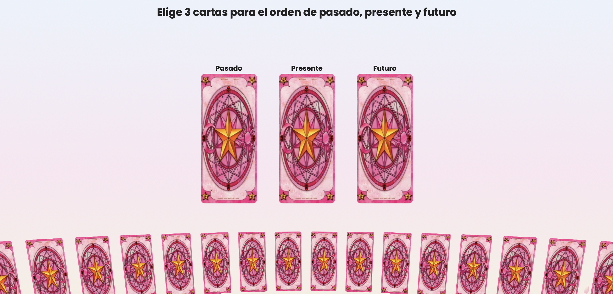
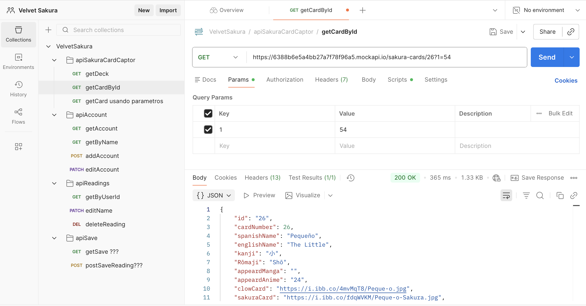
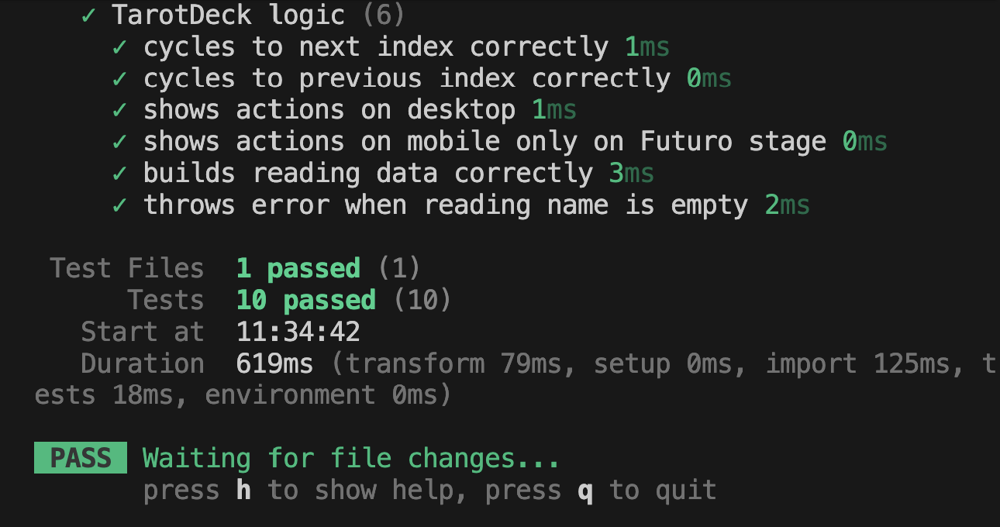

# Velvet Sakura

Velvet Sakura es una aplicación web interactiva inspirada en el tarot, creada para explorar lógica de programación, consumo de APIs y buenas prácticas de desarrollo frontend.

El proyecto combina una experiencia visual delicada con una arquitectura clara, enfocada en separación de responsabilidades, lógica reutilizable y validación de datos.

---

## Vista previa del proyecto

### Home


### Selección de cartas


---

## Concepto del proyecto

Velvet Sakura permite al usuario realizar una tirada de tarot de **pasado, presente y futuro**, obteniendo cartas seleccionadas de forma aleatoria a partir de un mazo consumido desde una API externa.

El objetivo principal del proyecto fue:
- Practicar consumo de APIs
- Diseñar lógica desacoplada de la interfaz
- Aplicar tests unitarios reales
- Validar flujos y respuestas de datos

---

## Tecnologías utilizadas

- **JavaScript (ES6+)**
- **React**
- **Vite**
- **CSS**
- **API REST**
- **Postman**
- **Tests unitarios (Vitest / Jest)**

---

## Consumo de API

La aplicación consume una API de cartas de tarot para obtener el mazo completo y realizar la selección dinámica de cartas.

Antes de integrar la API en la aplicación:
- Se validaron los endpoints
- Se analizaron las respuestas
- Se verificó la estructura de los datos

### Validación con Postman


Postman fue utilizado para:
- Probar peticiones GET
- Validar la consistencia de los datos
- Simular escenarios antes de integrarlos en el frontend

---

## Tests unitarios

La lógica principal del proyecto fue desacoplada de los componentes para permitir **tests unitarios reales**, enfocados en comportamiento y no en la UI.

### Funciones testeadas:
- Selección aleatoria de cartas
- Validación del mazo
- Asignación de posiciones (pasado, presente, futuro)



Esto permite:
- Detectar errores temprano
- Asegurar consistencia en la lógica
- Facilitar refactorización futura

---

## Estructura del proyecto

```bash
├── favicon
src/
├── assets/
│   ├── data/
│      ├── db.json
├── components/
│   ├── atoms/
│   ├── molecules/
│   ├── organisms/
├── layout/
├── pages/
├── router/
├── services/
├── index.css 
├── main.jsx
├── hooks/
├── utils/
├── tests/
```

## Instalación y uso local
### Clonar el repositorio
git clone https://github.com/tu-usuario/velvet-sakura.git

### Entrar al proyecto
cd velvet-sakura

### Instalar dependencias
npm install

### Ejecutar en local
npm run dev